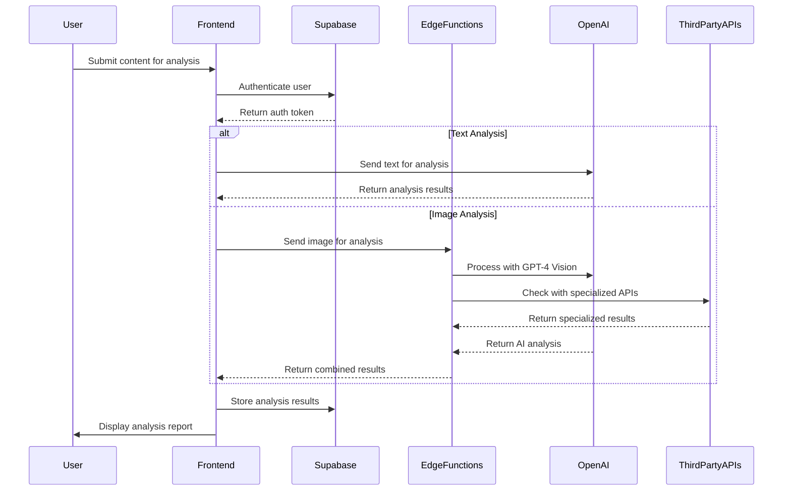
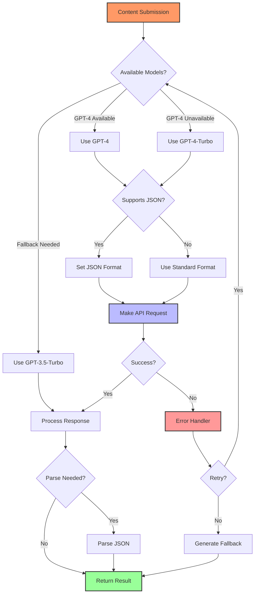
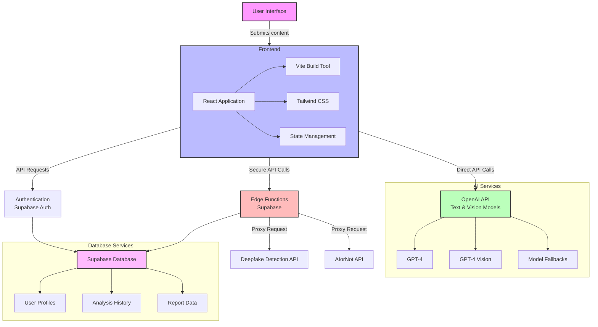
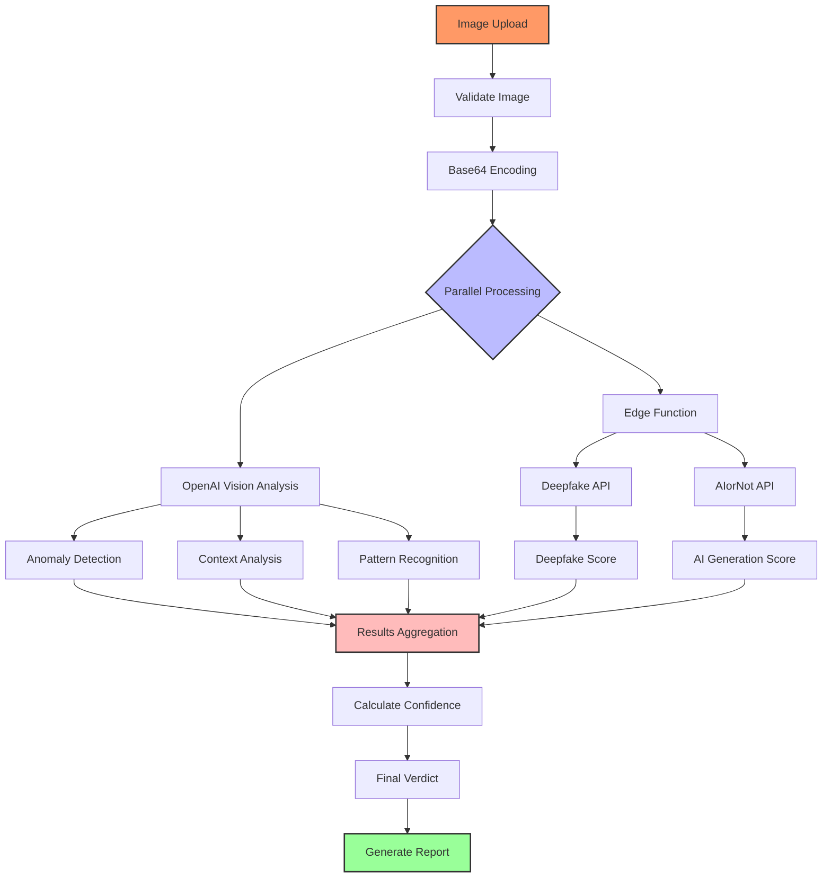

# Exposé

<div align="center">
  
  <h3>AI-Powered Misinformation Detection</h3>
  <p>Analyze news articles and images for misinformation, bias, and AI-generated content</p>
</div>

<p align="center">
  <a href="#features">Features</a> •
  <a href="#frameworks-and-technologies">Tech Stack</a> •
  <a href="#setup">Setup</a> •
  <a href="#how-it-works">How It Works</a> •
  <a href="#pages">Pages</a> •
  <a href="#license">License</a>
</p>

## Features

### 🔍 Comprehensive Content Analysis
- **Reliability Scoring**: Get instant reliability scores for any news article based on factual accuracy, source credibility, and bias detection
- **Bias Detection**: Identify political bias, emotional manipulation, and other persuasion techniques used in news articles
- **Claim Verification**: Automatically identify key claims in articles and verify their accuracy against trusted sources
- **AI-Generated Content Detection**: Detect AI-generated images and text with detailed evidence and confidence scores

### 📊 Detailed Insights
- **Evidence Quality Assessment**: Evaluate the strength and relevance of evidence presented in articles
- **Source Credibility Analysis**: Assess the reliability of cited sources and their expertise
- **Reasoning Soundness**: Analyze the logical consistency and validity of arguments
- **Contextual Completeness**: Identify missing context or information that could change interpretation

### 🔄 User Experience
- **History & Comparison**: Save your analysis history and compare reliability scores across different news sources
- **Customizable Analysis**: Tailor your analysis settings to focus on specific aspects of reliability
- **Browser Extension**: Analyze articles directly from your browser with our convenient Chrome extension
- **Dark Mode Support**: Enjoy a comfortable viewing experience in any lighting condition

### 🛡️ Privacy & Security
- **Secure Authentication**: Robust user authentication with email verification
- **Data Protection**: Strong row-level security ensures users can only access their own data
- **Privacy Controls**: Manage your data and privacy settings with granular controls

## Frameworks and Technologies

### Frontend
<p>
  
  
  
</p>

### Backend
<p>
  
  
</p>

### Database
<p>
  
</p>

### Authentication
<p>
  
</p>

### Development Tools
<p>
  
  
  
</p>

### Deployment
<p>
  
  
</p>

### APIs
<p>
  
  
</p>

This tech stack combines modern frontend technologies with powerful AI capabilities and a scalable backend solution, allowing for both web and browser extension implementations of the article analysis tool.

## Setup

1. Clone the repository
2. Install dependencies:
   ```
   npm install
   ```
3. Create a `.env` file in the root directory with the following variables:
   ```
   VITE_SUPABASE_URL=your_supabase_url
   VITE_SUPABASE_ANON_KEY=your_supabase_anon_key
   VITE_OPENAI_API_KEY=your_openai_api_key
   ```
4. Get your OpenAI API key from [OpenAI's platform](https://platform.openai.com/api-keys)
5. Set up a Supabase project:
   - Create a new project at [Supabase](https://supabase.com)
   - Enable email authentication in Authentication > Providers
   - Create the required tables with the following schema:

   ```sql
   -- Scans table
   CREATE TABLE scans (
     id uuid default uuid_generate_v4() primary key,
     created_at timestamp with time zone default now(),
     content text not null,
     source text,
     analysis jsonb,
     user_id uuid references auth.users(id),
     article_url text,
     is_hidden boolean default false,
     image_data text
   );

   -- Profiles table
   CREATE TABLE profiles (
     id uuid primary key references auth.users(id),
     created_at timestamp with time zone default now(),
     updated_at timestamp with time zone default now(),
     full_name text,
     website text,
     avatar_url text
   );

   -- User settings table
   CREATE TABLE user_settings (
     id uuid default uuid_generate_v4() primary key,
     created_at timestamp with time zone default now(),
     updated_at timestamp with time zone default now(),
     user_id uuid references auth.users(id) not null,
     openai_api_key text,
     theme text default 'light',
     email_notifications boolean default true,
     browser_notifications boolean default true
   );
   ```

   - If you already have an existing database without the `image_data` column, run this SQL command:
   ```sql
   ALTER TABLE scans ADD COLUMN image_data TEXT;
   ```

   - Set up Row Level Security (RLS) to protect user data:
   ```sql
   -- Enable RLS on all tables
   ALTER TABLE scans ENABLE ROW LEVEL SECURITY;
   ALTER TABLE profiles ENABLE ROW LEVEL SECURITY;
   ALTER TABLE user_settings ENABLE ROW LEVEL SECURITY;

   -- Create policies for scans table
   CREATE POLICY "Users can only view their own scans"
     ON scans FOR SELECT
     USING (auth.uid() = user_id);

   CREATE POLICY "Users can only insert their own scans"
     ON scans FOR INSERT
     WITH CHECK (auth.uid() = user_id);

   CREATE POLICY "Users can only delete their own scans"
     ON scans FOR DELETE
     USING (auth.uid() = user_id);

   -- Create policies for profiles table
   CREATE POLICY "Users can view their own profile"
     ON profiles FOR SELECT
     USING (auth.uid() = id);

   CREATE POLICY "Users can update their own profile"
     ON profiles FOR UPDATE
     USING (auth.uid() = id);

   CREATE POLICY "Users can insert their own profile"
     ON profiles FOR INSERT
     WITH CHECK (auth.uid() = id);

   -- Create policies for user_settings table
   CREATE POLICY "Users can view their own settings"
     ON user_settings FOR SELECT
     USING (auth.uid() = user_id);

   CREATE POLICY "Users can update their own settings"
     ON user_settings FOR UPDATE
     USING (auth.uid() = user_id);

   CREATE POLICY "Users can insert their own settings"
     ON user_settings FOR INSERT
     WITH CHECK (auth.uid() = user_id);
   ```

6. Start the development server:
   ```
   npm run dev
   ```

## How It Works

### Article Analysis

When you submit an article for scanning:

1. The application sends the article text to OpenAI's GPT-4 model
2. The model analyzes the text for misinformation, bias, and reliability
3. The analysis is displayed in a user-friendly format with detailed scores
4. Both the article and analysis are saved to your Supabase database

### Image Analysis

When you upload an image for analysis:

1. The application converts the image to base64 format
2. The image is sent to OpenAI's GPT-4o model (with fallback to other vision-capable models)
3. The model analyzes the image for signs of AI generation or manipulation
4. The analysis includes a conclusion, confidence score, and detailed evidence
5. Both the image (as base64) and analysis are saved to your Supabase database

## Pages

### Dashboard
- Main scanning interface with intuitive design
- Submit articles for analysis with paste or URL options
- Upload images for AI-generation detection
- View analysis results in real-time with interactive visualizations
- See recent scans with quick access to detailed reports

### History
- Comprehensive view of all past scans with advanced filtering
- Filter by scan type (articles or images)
- Filter by reliability score or date range
- Sort by date, reliability, or source
- Delete or archive unwanted scans
- View detailed analysis of any scan with expandable sections
- View analyzed images with detection results and evidence

### Settings
- Update profile information and preferences
- Change password and security settings
- Manage API keys for custom OpenAI integration
- Customize appearance with theme options
- Configure notification preferences for scan results

## Authentication Flow

### User Registration
- Email and password registration with validation
- Social login options (Google, GitHub)
- Email verification for account security
- Strong password requirements

### Authentication Process
- JWT-based authentication via Supabase Auth
- Secure token storage and management
- Automatic token refresh
- Session persistence across browser sessions

### Security Features
- Row-level security in database
- User-specific data isolation
- API rate limiting
- CSRF protection

### User Management
- Password reset functionality
- Account recovery options
- Profile management
- Session management across devices

## Contributors
- Tay Kai Wen (@newiakyat)
- Yeo Ke Jun (@yeokjunn)
- Nathan Pua (@nathanpua)
- Stephanie Heather Zaw (@stephan0b)

## System Architecture and Data Flow

### Data Flow Diagram



The diagram above illustrates the data flow within Exposé. When a user submits content for analysis, the system authenticates them through Supabase, then processes the content differently based on its type. Text analysis is handled directly through OpenAI, while image analysis involves both OpenAI's Vision capabilities and specialized third-party APIs via Edge Functions. All results are stored in Supabase and presented to the user in a comprehensive report.

### OpenAI Integration Flow



This diagram shows our robust OpenAI integration strategy. The system intelligently selects the most appropriate model based on availability, with fallback options to ensure continuous service. The flow includes format checking, error handling with retry logic, and proper response parsing to deliver consistent results regardless of the underlying model used.

### System Architecture



The system architecture diagram provides a high-level overview of Exposé's components and their interactions. The frontend layer, built with React, Vite, and Tailwind CSS, communicates with Supabase for authentication and data storage. OpenAI's powerful models handle content analysis, while Edge Functions securely proxy requests to specialized third-party APIs for enhanced image analysis capabilities.

### Image Analysis Pipeline



The image analysis pipeline demonstrates our comprehensive approach to detecting AI-generated or manipulated images. After initial validation and encoding, the system processes images in parallel through OpenAI's Vision capabilities and specialized third-party APIs. Multiple analysis techniques—including anomaly detection, context analysis, and pattern recognition—are combined with external API scores to calculate a confidence level and generate a detailed report with evidence supporting the final verdict.

## License

MIT

